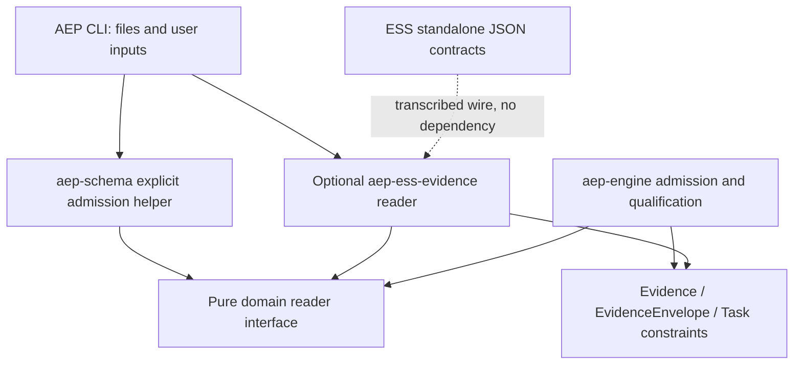
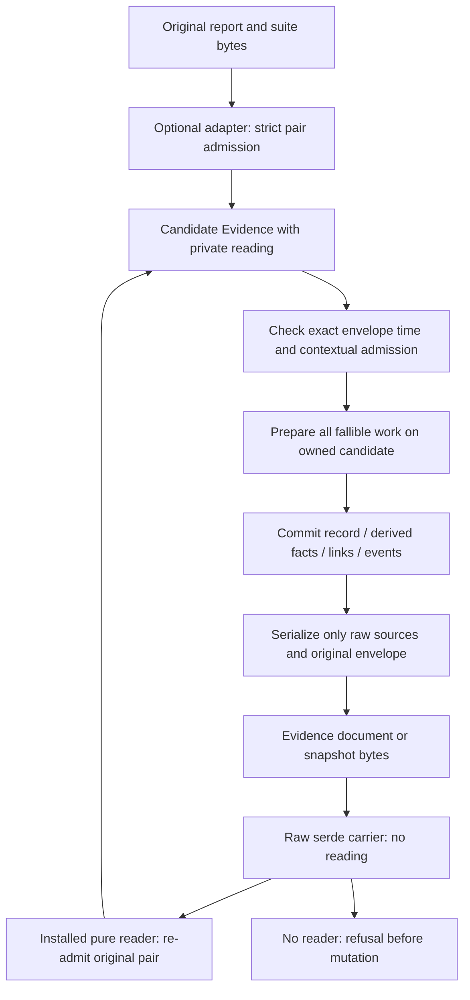

# ESS conformance v2 evidence admission

- Status: accepted for count-stage implementation on 2026-09-06 by the coordinator under standing ESS remediation authorization; binding review pass1's legacy-time warning is resolved explicitly below.
- Owner: `story:admit-ess-conformance-v2-counts`.
- Scope: exact diagnostic report/2 admission against original suite/1–4 JSON, typed AEP evidence/readback, and a nonqualifying complete-selection requirement.
- Coordinated migration: Atlas ADR0039, `architecture/adr/0039-ess-conformance-counts-migration.md`, and `story:ess-conformance-counts-migration`.
- Implementation and compatibility execution: pending.

## 1. Outcome and authority

AEP will admit the new standalone `ess-conformance-report/2` only with the exact original suite JSON it describes. It will retain exact counts, original bytes and completion time across its typed evidence and snapshot paths. Admission establishes document coherence and exact pairing. It does not establish complete conformance: admitted suite majors 1–4 have unknown coverage, so every count-stage report remains unable to satisfy a complete-selection conformance requirement.

The AEP boundary stays optional. The standalone format reader belongs in `aep-ess-evidence`; domain and engine depend on a pure interface and AEP-owned values, never the adapter or a compiled ESS modeling crate. ESS gains no AEP dependency. These are representations under existing Evidence, EvidenceEnvelope and Task.constraints, not new independently identified runtime entities.

The ESS contract authority is `docs/design/review-conformance-coverage.md` at ESS `ba43fda29de637ad9323d96c4bb9aac10f48ae64`, SHA-256 `4d3c0db04da9e63eab3e581fbd5f9f3214311f4df72a9cb3c2e7d4da43244db3`. That document distinguishes count-stage report/2 and run/2 from the later suite/5 coverage implementation. Its earlier source citations are historical observations, not claims that those features already execute. This AEP binding transcribes the count-stage portion; it does not redefine the ESS wire.

AEP source citations below refer to `00c742e4179593738a2e8aa69e2ecc07d3c89402`. At that source both actual report readers remain report/1-only. The existing domain result stores usize counts; ObservedAt reads numbers through Node; snapshots deserialize Evidence directly. Those facts motivate the new contract rather than establish its implementation.

The frozen controls are report/1 shape, valid historical behavior and aggregate semantics; `ess_conformance` evidence and facts; legacy profiles/principle/protocol; ESS suite/1–4 writer bytes; existing ESS source/model/contract digest profiles; current defaults. No release/tag, default switch, generic facts journal or global Number/Node migration is authorized by this design.

## 2. Typed owners and dependency direction

| Existing owner | Required addition or change |
|---|---|
| `aep-domain/src/evidence.rs` | New EvidenceKind/Evidence variant `ess_conformance_v2`; immutable original-source carrier; typed diagnostic reading; exact counts, profile/status and SuiteReference value types; pure reader interface; explicit raw/admitted access and fact projection. |
| `aep-domain/src/time.rs` | Direct exact ObservedAt scalar/date visitor, preserving legacy calendar semantics; v2 record checks use exact instant equality and checked arithmetic. Timestamp remains u64. |
| `aep-domain/src/task.rs` | Optional typed `Constraints.ess_conformance_v2`; validated expected model reference, exact SuiteReference and selected IDs. RawTask already owns Constraints; no independent entity/schema service. |
| `aep-domain/src/requirement.rs` | One per-record qualifier for the new kind; default-failing RequirementContext access to independent task inputs; context-free matches cannot claim v2 qualification. |
| `aep-engine/src/engine.rs, execution.rs, error.rs` | Explicit optional reader installation; admission before mutation and snapshot reconstruction; Result from direct recording; same qualifier for evaluation and evidence.missing. |
| `aep-ess-evidence/src/lib.rs` and private package modules | Sole shipped closed ESS report/suite transcription and original-byte pairing implementation; existing v1 adapt_json retained. No ESS crate dependency. |
| `aep-schema/src/parse.rs` | Raw parsing versus explicit reader-bearing admission helper; closed v2 input envelope, exact scalar/readback behavior. Takes the domain interface, so no compiled adapter dependency is necessary here. |
| `aep-cli/src/app.rs, drive.rs, planning.rs` | All actual edge read/restore paths install/use the optional reader; planning adds explicit paired-suite input and truthful diagnostic persistence. CLI→observe is permitted by AGENTS. |
| Rust schema generator | New kind/result propagation plus task constraint. Generate only through cargo xtask schema. |

Proposed Rust names in this document are binding responsibilities and API roles, not declarations present at the opening commit. The implementor may use private modules and idiomatic names without changing these boundaries.



The diagram shows data/interface use, not a proposed observe→edge crate dependency. `aep-schema` accepts the trait supplied by the CLI; it does not import the adapter. Engine/Execution retain the interface behind an optional Arc; they do not select plugins by ambient registry, environment or serialized name.

## 3. Count-stage standalone wire admission

The v2 report is closed. All of these fields are required:

| Field | Count-stage contract |
|---|---|
| format | Exactly `ess-conformance-report/2`. |
| specification, implementation | Existing source labels retained without inventing authorization or artifact identity from them. |
| spec_digest | Existing 64-hex model digest; must agree with the paired suite's provenance.spec_digest. Its algorithm/spelling is unchanged. |
| producer_profile | Exactly `rust-scenario-status/1` or `go-scenario-status/1`. |
| suite | Closed `{version, digest_profile, digest}`; version exactly suite/1, /2, /3 or /4; digest_profile exactly `sha256-json-bytes/1`; digest is `sha256:` plus 64 lowercase hex digits. |
| execution_status | passed, failed or inconclusive, recomputed from the selected producer profile. |
| counts | Exactly total, passed, failed, error, unsupported, skipped; each exact u64. |
| outcomes | Exactly passed, failed, error, unsupported, skipped; each sorted/distinct plain ScenarioId list, no status prefixes. |
| coverage | Exactly `{knowledge: unknown}`. No inventory/selection/refusal fields are accepted in this count-stage form. |
| conformance_status | failed when execution_status is failed; otherwise inconclusive. Passed is invalid for the admitted legacy suite pair. |
| policy | Exactly `complete-selection/1`. |
| completed_at | Exact unsigned decimal epoch-millisecond integer, full u64 range. |

Unknown keys at every closed level, duplicate object keys, missing fields, unknown enum/profile/policy/digest versions and malformed identities refuse. Arbitrary keys inside a declared legacy scenario payload Node remain payload, not envelope extensions. Report/run/format dispatch cannot rely on a generic suite support helper that may later grow.

Count rules:

- Checked sum of the five categories equals total.
- Every count equals the corresponding outcome list length, using checked length conversion to u64.
- Lists are individually sorted/distinct and pairwise disjoint.
- Their union equals exactly the selected scenario-map keys of the paired suite. A terminated or host-filtered run with unobserved selected IDs is not a complete report.
- Rust requires skipped=0. Its aggregate is failed if failed>0 or unsupported>0; otherwise inconclusive if error>0; otherwise passed, including zero terminal scenarios.
- Go requires error=0 and unsupported=0. Its aggregate is failed if failed>0; otherwise inconclusive if skipped>0; otherwise passed, including zero terminal scenarios.
- These are final scenario categories. Do not re-run per-check precedence in AEP. In ESS, Rust per-scenario precedence differs from whole-run aggregation, and Go teardown may change a skip into failed; those producer semantics remain unchanged.
- Optional displayed non_pass is checked total minus passed. It is never stored under a v2 field named scenarios_failed.

Admission retains all category detail even when it is not useful to a conformance gate. A zero-total v2 pair may be diagnostically admitted; it cannot qualify. The old planning report/1 zero-total refusal stays in its own branch.

### 3.1 Original suite and complete byte identity

Hash every byte of the actual UTF-8 suite JSON, including a final newline when present, before any reserialization. CRLF/LF, whitespace, key order, Unicode escapes and omitted versus explicit defaults affect identity. Report bytes and file paths are not the suite digest. A pre-parsed object or the reduced Go execution struct cannot substitute for the original suite.

The reader must admit the paired suite's actual supported version, complete typed envelope and vocabulary, including scenario metadata/dependencies that a runner may not use. Merely extracting provenance and scenario keys is insufficient. The transcription is bounded to ESS's frozen suite/1–4 declarations at the cited source: `scenario.rs:101–107,236–269,308–427,896–944`, plus its ScenarioId, ScenarioValue, shape, Holds, ScenarioStep and ViewExpectation declarations. Respect actual historical optional/default fields; do not require a v5 coverage field on a legacy document.

The version allowlist is explicit. Syntax parsing of `SuiteFormat` alone does not prove runtime support (ESS scenario.rs:423–427). Refuse unknown nested tagged vocabulary instead of ignoring it or interpreting it as a skipped result. Duplicate-key detection precedes conversion to maps. The exact-version/field vectors used to establish all four majors must be retained; no version-only fixture proves complete vocabulary support.

Pair admission compares report suite version, hashed exact suite bytes, suite provenance model digest and selected membership. Label text is retained as source description; it is not a substitute for a model digest or an independently chosen governing artifact. This checks internal coherence, not whether a builder enumerated all obligations or a runner honestly executed them.

Suite/5, v5 coverage objects, parent admission, complete inventory, refusal multiplicity and source-origin qualification are refused until the separately bound coverage reader exists. No fallback to unknown by discarding a supplied v5 object is permitted.

### 3.2 Exact scalars

All new report counts and timestamps admit 0 through 18446744073709551615. Original JSON count/time tokens must be `0` or a nonzero ASCII digit followed by digits: no sign, leading zero, fraction, exponent or quoted number. Reject before any narrowing/conversion; JSON layout freedom does not relax scalar spelling. A standard integer visitor by itself is not proof of lexical rejection of -0 or equivalent spellings.

Parse embedded report scalars directly from original bytes using an exact representation. Never route those scalars, or actual integer tokens in typed JSON/YAML transport, through Node::Number, binary64, usize or i64. The shared ObservedAt reader retains the separately bound legacy floating/exponent interpretation below; that exception does not apply to embedded report JSON. The inner report remains original JSON even inside YAML; its strict lexical rule is reapplied on readback. Existing finite payload-number semantics are a separate legacy domain and are not subjected to the new count/time token rule.

Use checked arithmetic for sums, length conversions, subtraction and any timestamp/duration conversion. Do not allocate huge outcome lists to test boundary scalars: test scalar admission independently, then use small genuine complete report pairs for list coherence. An accepted maximum scalar does not imply a report with an impossible list length is coherent.

## 4. Raw carrier, reader and constructor contract

Add `Evidence::EssConformanceV2(EssConformanceV2Sources)`. Its only serialized payload fields are:

```json
{
  "kind": "ess_conformance_v2",
  "report_json": "<original report JSON text>",
  "suite_json": "<original suite JSON text>"
}
```

The placeholders describe transport strings, not sample valid reports. An adapted evidence-document entry also uses the existing observed_at, producer, about and provenance envelope fields.

The source carrier has private immutable strings and a private optional reading. Raw construction and Deserialize retain strings, establish no semantic admission, and initialize no reading. There is no mutable string accessor. Source replacement creates a new raw carrier. Serialize never writes the reading, a verification boolean, a trusted hash assertion or an admission flag; JsonSchema likewise exposes only the raw wire. Closed input refuses attempts to supply those hidden fields.

Define a pure, narrow domain reader interface, conceptually:

```rust
trait EssConformanceV2Reader: Debug + Send + Sync {
    fn read(&self, sources: &EssConformanceV2Sources)
        -> Result<EssConformanceV2Reading, EssAdmissionError>;
}
```

The error has stable structured reason/path/detail diagnostics and retains actual parser/identity/count causes. Accumulate independent defects where the source can be parsed safely; dependent interpretation stops at a failed version or structural boundary. Tests assert reasons/paths, not only is_err or arbitrary text.

The typed reading is not deserializable. It has read-only access to exact category counts, outcomes/selected IDs, labels, model/suite identity, profile/status and completed_at. Its checked construction enforces the domain count/profile/status invariants. Its count-stage coverage representation has no constructible complete-inventory case; it cannot produce conformance passed. The optional adapter owns the stronger original-byte suite transcription/hash check.

A source carrier's explicit admission method always calls the supplied reader and installs a reading only on success. Failed re-admission must not leave an earlier reading available on a mutable candidate. Prefer constructing a new admitted candidate from the unchanged strings and moving it into the destination only on success. No operation accepts a caller-supplied boolean or deserialized cache as proof.

In shipped code only the optional adapter implements the ESS wire reader. The interface is an explicit trusted Rust extension boundary: a custom program could implement a dishonest reader or RequirementContext. It is not cryptographic attestation or an unforgeable cross-crate token. Untrusted documents cannot supply or select that implementation.

The private cache is safe because strings are immutable, replacement clears it, Deserialize never restores it, and all submission/direct-record/restore boundaries re-admit. A cache cloned with immutable source bytes may be inspected in-process, but mutation admission never trusts its prior presence.

### 4.1 Raw versus admitted APIs

Raw Deserialize of Evidence, EvidenceEnvelope<Evidence>, EvidenceInput, VerificationResult evidence arrays and Snapshot is permitted as structural input. It is not an admitted domain observation. For raw v2:

- facts returns no category/status/model facts;
- spec_digest returns no admitted model claim;
- summary identifies an unadmitted source pair;
- all qualification paths fail closed;
- ordinary source getters remain available for explicit admission or archival.

After admission, typed getters and fact projection may expose the reading. A schema validating the carrier means its transport shape is valid; it does not prove embedded JSON semantics, source pairing or conformance.

The explicit no-reader evidence-list helper must refuse v2 admission. The reader-bearing helper performs paired-byte and envelope checks; direct serde remains clearly documented raw input. A core-only consumer may archive raw input but must install an appropriate reader to admit it.

## 5. Admission, mutation and restore graph



Reader configuration belongs to the engine/execution, never a document. Preserve `Engine<C>`'s current clock generic; add optional `Arc<dyn EssConformanceV2Reader>` with a default-refusing implementation/path. Engine initialization passes the configured reader to the execution; it is fixed for that execution. No snapshot serializes it or a cached verdict. Existing core constructors continue working for legacy evidence and refuse v2 without explicit installation.

All fallible v2 admission prepares owned candidates before publication into live state. One internal preparation routine checks source admission and envelope integrity; submission, direct recording and restore reuse it.

| Boundary | Required ordering |
|---|---|
| Engine::submit_evidence | Capture caller-provided clock time once; retain existing declared-kind and task-subject checks; re-admit pair, require instant observed_at equal completed_at, and reject future observation before any links, observe_at refresh, append or event. Then commit through an infallible/private prepared-record operation. |
| Public Execution::record_evidence | Return Result. Use the execution's configured reader and evaluated_at for the new kind; if there is no reading time, refuse v2 mutation with an explicit missing-time reason. Prepare before append/refresh. Legacy records retain their current semantics. |
| Engine::restore | Resolve the caller's current task/documents/graph; capture current clock; re-admit every candidate v2 record, including its envelope/time, before returning an execution. A single refusal prevents partial reconstructed state from escaping. |
| Reader-bearing Execution restore | Accept an explicit reader and evaluation instant; remain IO-free. Reuse candidate preparation for all records, then construct the live state and project facts. |
| Existing reader-free Execution::restore | Preserve legacy restoration; refuse any v2 record without a reader. It must not quietly produce an execution containing trusted v2 facts. |
| Edge inspection/adaptation | Validate original bytes and envelope equality before labeling a v2 record admitted. Future/freshness inspection uses explicit reference time; it does not stamp a new observation time. |

The extra direct-record/restore time requirement applies to this new evidence kind only. Engine already owns the clock-read boundary; domain/Execution do not read ambient time. If a public method obtains no current time, returning unknown/refusal is the correct incomplete state.

Preserve record IDs, original observed_at/produced_at/provenance, arrival state and order when restoring. Do not feed snapshots back through normal new submission, invent new IDs, restamp times or derive evidence from ProtocolEvent. Snapshot events remain history. Existing integrity checks and task/step-map agreement remain in effect; these additions do not authenticate arbitrary edited snapshots or reconstruct past transitions from event claims.

### 5.1 Established routes

The complete file-by-file inventory is retained in the launch evidence, `admission-binding-proposal.md`, SHA256 `22f2d982a6006fc8809b7a95d69c405afe0d6365a822e9aca8ee84fa7c09519d`. The binding groups its actual routes as follows:

- **Typed files and inspection:** schema parse.rs:191–194,324–349; CLI app.rs:1797–1834,2312–2328,2755–2780. Evidence inspection has no Engine submission to supply a missing check.
- **Snapshot and direct library entry:** engine.rs:59–111,336–425; execution.rs:43–74,205–211,246–305. EvidenceSubmission is mutable; direct recording and restore must independently prepare candidates.
- **Nested raw serde:** domain evidence.rs:1427–1459,1943–2019 and verification.rs:389–408. Raw Evidence, envelopes, VerificationResult evidence arrays and Snapshot never acquire a reading merely by deserializing.
- **Driver:** CLI drive.rs:718,948,3501–3504 installs the reader at all three production Engine constructors; drive.rs:5070–5104 reads exactly one mapped record and retains human/approval refusal. Driver run.rs:304–443,763,998–1003 reads consistent snapshot/cursor generations, then uses Engine restore/submission. No separate driver parser dependency is required.
- **Protocol events:** domain event.rs:86–99,211–220 and engine trail.rs:144–154 retain ID/kind/producer/state, not original ESS bytes. Events cannot recreate admitted evidence.
- **Independent planning reader/history:** CLI planning.rs:5907–5985 must share v2 admission; 5846–5889,6545–6620,849–876 and markdown journal.rs:129–144,295–314 carry/count descriptive records rather than typed source pairs.

Tests must exercise these actual routes, including driver resume. This bounded local inventory is not a claim about every external executable.

## 6. Exact envelope time and facts

Timestamp remains u64 (`time.rs:35–53`). Replace ObservedAt's Node-mediated deserializer (`647–670`) with direct exact unsigned-integer/date admission and a narrow legacy floating/exponent branch. Actual integer tokens preserve the full u64 value. The legacy branch reproduces the existing Number interpretation and rejection behavior, including integral `1.0`/`1e0` and negative floating zero mapping to0; nonintegral/negative/out-of-range cases retain their established result. Do not silently narrow existing evidence transport to unsigned-token spellings only. Preserve calendar-date parsing, granularity, serialization and legacy future/day behavior. This is the explicit resolution of binding review pass1, grounded in time.rs:647–659, node.rs:33–51 and facts.rs:63–65,109–118; runtime compatibility is still to be tested.

For v2, observed_at must be instant granularity and exactly the report completed_at. This rule applies after typed JSON/YAML input, direct construction and snapshot readback. A calendar date that contains the completed instant is not equality. produced_at stays the engine's submission time and is not substituted for observation time.

V2 qualification uses checked now-minus-completed_at and refuses a future value, missing time or overflow/narrowing failure. If a horizon is declared on the requirement, compare exact age against its checked duration. Equality at the horizon remains covered. Do not use saturating age arithmetic for v2. If an expiry is displayed/calculated, checked-add overflow refuses that operation; qualification need not compute an unnecessary expiry. No new default TTL is selected: an omitted horizon means no expiration limit, but time must still be known and not in the future.

Admitted v2 diagnostic facts use the new namespace only. Bind these meanings; generated public type/docs should list the actual final keys:

| Fact family | Representation/meaning |
|---|---|
| `ess_conformance_v2.counts.{total,passed,failed,error,unsupported,skipped}` | Canonical decimal Text from exact u64. |
| `ess_conformance_v2.completed_at` | Canonical decimal Text, never a floating point fact. |
| `ess_conformance_v2.execution_status`, `.conformance_status`, `.producer_profile`, `.policy` | Exact closed source meanings. |
| `ess_conformance_v2.spec_digest`, `.suite.version`, `.suite.digest_profile`, `.suite.digest` | Admitted identities as Text. |
| `ess_conformance_v2.nonempty`, `.failed_zero` | Typed Boolean from exact arithmetic. |
| `ess_conformance_v2.coverage_known`, `.passed` | False for every count-stage reading; passed means complete conformance, never merely passed execution. |

Do not put a global `qualified` fact on a record: qualification depends on an independent task/requirement/context. Any optional non_pass display is checked and labeled plainly. Numeric-looking Text is not safe for ordering or truthiness; use booleans or quoted decimal equality. Keep old `ess_conformance` facts untouched.

## 7. Independent expectation and shared qualification

### 7.1 Task-owned value

Add optional `constraints.ess_conformance_v2` to existing Constraints. Its closed shape is:

```yaml
constraints:
  ess_conformance_v2:
    model: executable-system-specification:billing
    suite:
      version: ess-conformance/4
      digest_profile: sha256-json-bytes/1
      digest: sha256:<64 lowercase hex>
    selected_ids: [<actual selected ScenarioId>]
```

This illustrates fields, not a valid fixture. Validate actual IDs with the frozen wire grammar, sorted/distinct order and exact supplied-suite identity. Empty selected_ids is an explicit diagnostic expectation, never a complete-conformance pass.

The existing task subject is required for qualification. The expectation does not duplicate it. The model ArtifactRef must resolve to the named executable-system specification in the fresh graph with an explicit current model_digest. Compare that model only; the old helper's any-model match, empty-graph exception and always-valid escape cannot replace this v2 current-model requirement. Missing model/digest/subject/expectation yields unknown, not implicit agreement.

Read expectations from the resolved `plan.task.constraints`, not the final FactStore. Record facts cannot overwrite them. Neither report adaptation nor snapshot replay populates expectations from observed bytes. The caller supplies/approves expected inputs before consuming the report. Task changes are caller authority under existing governance, not a cryptographic invariant.

Constraints::is_empty must account for the optional value, and RawTask validation/serialization must preserve it. Schema propagation includes `task.schema.json`. RequirementContext gains default-failing access to this value and the task subject; custom contexts without them cannot qualify.

The expected IDs denote an exact count-stage selection only. They do not establish system/component scope, authored/generated origins or complete inventory. Suite/5 qualification requires a later explicit expectation extension covering the accepted full Selection and parent contract. Do not implement a dormant complete=true branch now.

### 7.2 One per-record decision

Add a domain `qualify_record` API on EvidenceRequirement, returning a stable structured result such as Qualified, Unknown(reason) or Contradiction(reason), with actionable details. Every requirement whose kind is ess_conformance_v2 uses it, including a bare-kind requirement or a directly constructed requirement.

Only Qualified contributes to at_least. For v2, at_least=0 is invalid and is handled fail-closed even for manually constructed requirements. Context-free public matches returns false for this kind and directs callers to qualify_record; it has no current model/expectation/time inputs and cannot truthfully claim qualification.

The common decision checks this record's:

1. kind and admitted reading;
2. required task subject and any explicit requirement subject;
3. independent non-agent producer and exact conformance-runner verifier, without a weaker provenance.tool fallback;
4. explicitly named expected model and its current digest;
5. complete expected SuiteReference and selected-ID equality;
6. exact envelope/report instant agreement, known evaluation time, no future observation, and the requirement's optional horizon;
7. nonempty selection and recomputed execution/policy/conformance outcome;
8. coverage sufficient for complete-selection.

Keep reasons stable and distinguish no knowledge from observed contradiction. Missing admission/expectation/model digest/time/coverage is Unknown; mismatching observed identity or execution failure is a Contradiction. A stale reading is Unknown; a future or mismatched envelope time is also rejected at mutation admission and cannot count if presented through a custom context. No other record's projected facts repair any reason.

For count-stage readers the final coverage check always returns UnknownCoverage on an otherwise matching valid reading. A failed execution may report its more specific contradiction first. No count-stage test may construct a qualifying complete-inventory reading as a positive control.

EvidenceRequirement evaluation and Execution::satisfies_evidence must both call this same function. Evidence.missing counts a v2 requirement as unmet unless enough Qualified records exist; therefore it remains unmet at this stage. Diagnostic truth can be Unknown while the derived missing==0 predicate is false: that is a count's existing polarity, not disagreement. Legacy branches keep their current behavior.

The generic evidence.count.kind and first/last sequence facts remain historical record counts. Do not label them qualified counts. A correct-subject failed record followed by a wrong-subject passed record, or two records satisfying different identity conditions, cannot satisfy the new requirement.

## 8. Opt-in policy and public CLI

Use these chosen additive leaves:

| File | Required composition |
|---|---|
| `principles/verification/ess-conformance-v2.yaml` | id ess-conformance-v2, version 1. Where an executable-system specification governs the task, before-completion requires kind ess_conformance_v2, at least one, independent true, verifier conformance-runner. Its meaning is the shared qualifier, not a conjunction of global status/count facts. |
| `protocols/adp-ess-conformance/2.yaml` | id adp-ess-conformance, version 2, extends adp/1; adds kind ess_conformance_v2 and observable ess_conformance_v2.**. Existing conformance-runner is inherited. |
| `profiles/development-ess-conformance-v2.yaml` | id development.ess-conformance-v2, version 1, extends development.standard, protocol adp-ess-conformance/2, adds the new principle. |
 
Do not extend development.critical: it adds the legacy ess-conformance principle. Do not edit adp/1 or default profiles to activate v2. Registry/Profile composition must be tested against actual documents: source Profile::extend starts from the derived profile, inherits/merges principles and completion, and resolve checks the profile's more specific protocol (`profile.rs:81–116`, `aep-engine/src/resolve.rs:48–77`). This is source-backed feasibility, not an executed composition result.

The profile deliberately cannot complete ESS-governed work from count-stage reports alone. It exposes a truthful opt-in requirement before the later coverage stage. Documentation must say this explicitly; it is not a production-ready complete-coverage gate.

Add planning syntax:

```console
aep plan artifact evidence <id> --from <report.json> --suite <suite.json> [--ref <reference>]
```

- report/2 requires explicit --suite and both files are read as original UTF-8 JSON.
- --suite without --from refuses. report/1 with --suite refuses as unsupported pairing control, leaving the report/1 route unchanged.
- --from retains conflicts with manual kind/source/at/review/outcome. --ref remains an independent display/reference override and cannot replace suite bytes.
- report/run format dispatch is explicit: report/2 means standalone report, not detailed ess-conformance-run/2. Reject detailed run/2 here; no inferred summary extraction.
- Preserve current v1 zero-total refusal. V2 zero-total may record truthful diagnostic history after valid pairing.
- Read/admit before store opening/mutation. All refusal paths leave the journal/artifact/store unchanged.
- Record kind ess_conformance_v2, all six exact counts, both statuses, unknown coverage, producer profile, model/suite identity, exact completed_at decimal, and both actual input references in descriptive source. Keep reference override separately. Use a stable escaped/structured diagnostic rendering so paths containing separators cannot silently obscure attribution.
- This planning record is descriptive history, not a typed evidence/suite archive and not a qualified lifecycle verdict. Do not add v2 count-based planning lifecycle requirements as part of this unit.

The direct adapter and typed evidence commands continue using the inline byte carrier. No new adapter CLI verb or file-recovery service is required.

`aep observe evidence inspect` must use paired admission for the new kind and preserve exact time meaning in structured output/diagnostics. Existing canonical/alias command equivalence remains required.

### 8.1 Planning time readback

`planning.rs:5696–5708` already parses u64 decimal into Timestamp. Its legacy report reader's `as_i64` at 5973 does not limit the new branch. The entity backend retains exact issued_at as `payload.at` (`aep-backend-entity/src/lib.rs:239–248`), while recorded_at uses ISO seconds and loses milliseconds (`time.rs:57–73`).

Persist the exact completed_at decimal in source text as well. Do not claim the human history date is exact. There is no blanket i64::MAX refusal. Test actual chosen backend/history roundtrips through the full u64 range; if a concrete downstream date renderer cannot represent a value, explicitly refuse that adaptation before mutation, without changing the valid wire value or calling it missing. This design does not widen every backend/calendar API.

Update the exact public CLI reference leaf `website/docs/reference/cli.md`: line 96 currently states --from reads report/1 and refuses no scenarios; line 364 describes evidence inspect. Keep the legacy statement scoped to v1, add paired v2 syntax/unknown-coverage limits, and distinguish descriptive history from qualification. This public-source edit requires normal source publication and Website/Atlas delivery checks.

## 9. Compatibility and scope

`Execution::record_evidence` changes from returning () to returning Result<(), ProtocolError>. This is a public Rust source API change even though its only discovered local calls are inside aep-engine (execution.rs, policy.rs, engine.rs). Existing callers must handle refusal. Do not offer a silently dropping or panicking compatibility wrapper. Existing reader-free constructors remain additive/default-refusing for the new evidence kind. External library users are not proven migrated by a local absence search.

Private admitted readings are intentionally absent from serialized evidence/snapshots. Old AEP readers refuse the new kind/constraints; this is deliberate additive opt-in vocabulary, not proof of forward compatibility. No existing ESS format meaning changes. Generated schema changes originate from Rust types only.

Bound implementation scope:

- cited packages: crates/observe/aep-ess-evidence, crates/govern/aep-domain, crates/govern/aep-engine, crates/edge/aep-schema, crates/edge/aep-cli;
- inferred binding and selected leaves: docs/design/ess-conformance-v2-evidence.md; principles/verification/ess-conformance-v2.yaml; protocols/adp-ess-conformance/2.yaml; profiles/development-ess-conformance-v2.yaml;
- inferred generated: schemas/generated/{artifact-lifecycle,artifact-manifest,driver-steps,event,evidence,principle,profile,protocol,workflow,task}.schema.json, narrowed/expanded only from actual generator output and coordinator review;
- cited public leaf: website/docs/reference/cli.md;
- cited CHANGELOG.md; inferred Cargo.lock for the adapter hashing/CLI dependency edge.

No production driver/backend, global Number/Node, root Cargo.toml, Taskfile or workflow edit is established. Any newly necessary generated/runtime source path must be surfaced to the coordinator before changing the scope. CLI already depends on sha2 0.11; an adapter hashing dependency must be intentionally documented in its manifest and respect MSRV. All executable additions here are Rust.

## 10. Reason-specific red-first verification

Each new behavioral test must run alone after it is written and before package suites. Preserve actual failure output, exact source subject, command/exit and final green result. Distinguish setup/compiler errors from meaningful assertion failures. Mutation-test guarded conditions using the repository's requirements; an unchanged assertion that passes only because every v2 report is rejected does not prove a reader.

The following matrix binds required behaviors; test names may differ but handoff evidence maps each row to actual cases.

| ID | Probe and specific expected reason/control |
|---|---|
| A01 | Genuine Rust-profile report/2 + original suite/1–4 pairs admit; category/status/time/bytes retained; positive admission controls for each actually supported major. |
| A02 | Genuine Go profile passed, skipped-only, mixed failed/skipped pairs admit with exact categories; never turn skipped into failed. |
| A03 | Rust error-only yields inconclusive, unsupported-only failed, error plus a separate unsupported scenario failed; disallowed Rust skipped/Go error/unsupported refuse ProfileOutcomeMismatch. |
| A04 | Unknown report version, suite major, digest profile, producer profile and policy each refuse their named unsupported reason before dependent interpretation. Suite5 is included. |
| A05 | Duplicate keys at report/nested counts/outcomes/suite/scenario/payload levels and unknown closed fields refuse; legitimate arbitrary payload keys remain a control. |
| A06 | Original whitespace/newline/Unicode-escape change gives SuiteDigestMismatch without parsing/reserializing identity; outer transport escaping roundtrips identical inner bytes. |
| A07 | Missing suite, altered suite provenance model digest, report model mismatch and wrong suite-reference version refuse distinct pairing reasons. |
| A08 | Counts sum overflow, total mismatch, per-category length mismatch, duplicate/cross-category IDs, unsorted lists and missing/extra selected IDs each fail their own rule. |
| A09 | 0, 9007199254740993, i64::MAX, i64::MAX+1, u64::MAX scalar values remain exact; -1, -0, +1, leading zero, fraction, exponent, quoted and overflow count/time tokens refuse. Separate scalar tests from realistic list sizes. |
| A10 | Zero-total valid v2 pair admits diagnostically with inconclusive conformance; report/1 planning empty fixture still refuses under its frozen rule. |
| A11 | coverage complete_inventory, legacy report claiming conformance passed, or a v5 object stripped/relabelled as legacy refuses, never normalizes to unknown. |
| B01 | Direct serde Evidence/EvidenceRecord/VerificationResult/Snapshot creates raw v2 with no reading/facts/model claim; explicit real-reader re-admission produces the original reading. |
| B02 | Serialized verified/admitted/cache/derived-count input and extra v2 envelope fields refuse; alias/canonical duplicate fields cannot bypass duplicate checks. |
| B03 | Carrier source replacement clears reading; failed re-admission leaves no earlier reading usable. Serialize never emits the cache; Deserialize cannot restore it. |
| B04 | JSON/YAML adapted entry and nested snapshot readback preserve exact full-u64 integer completed_at/observed_at and source strings. Legacy calendar-day controls preserve granularity and behavior. Preserve legacy integral floating/exponent/negative-floating-zero controls and existing nonintegral/negative/overflow refusals. A large floating envelope that rounds away from the embedded report instant must refuse ObservationMismatch; it cannot freshen the original report. |
| B05 | Altered observed_at or calendar-day envelope refuses ObservationMismatch/InstantRequired despite valid source bytes; future time refuses before mutation. |
| B06 | Engine with no reader rejects raw and previously admitted v2; legacy valid record still works. Direct Execution::record_evidence and reader-free restore also refuse; missing evaluated_at on direct v2 mutation is explicit. |
| B07 | Refused submission leaves records, links, facts, event stream, sequence and prior evaluation state unchanged. Include a previously nonempty execution control. |
| B08 | Restore candidate with one valid and one invalid v2 record returns no partial execution; original IDs/times/states survive valid restore; current reader is invoked despite any in-memory cache. |
| B09 | ProtocolEvent::EvidenceProduced or VerificationPassed alone never recreates a v2 reading/qualification. Snapshot events cannot supply missing evidence bytes. |
| Q01 | Valid same-record expected model/suite/selection/subject/verifier/time reaches UnknownCoverage specifically; it never qualifies or reduces the requirement's missing count. |
| Q02 | Missing independent expectation/subject/model/current digest/time yields the corresponding Unknown reason, not wildcard/current/no-expiry assumptions. |
| Q03 | Wrong subject, named model/digest, suite version/profile/hash or selected IDs produces the specific mismatch before UnknownCoverage. A digest matching another graph model is insufficient. |
| Q04 | Agent/wrong verifier cannot qualify, including provenance.tool claims. Correct verifier is an admission/identity control, not a complete-coverage positive. |
| Q05 | Freshness equality at horizon boundary, just expired, future and missing time use exact arithmetic and stable reasons; no saturating repair. Any computed expiry overflow refuses its operation. |
| Q06 | Correct-subject failed plus wrong-subject passed, and records split across model/suite/selection/time matches, remain unqualified in both evaluation and evidence.missing. Arrival-order fact overwrite cannot repair a record. |
| Q07 | Bare v2 requirement, context-free matches and manually constructed at_least=0 do not bypass qualification. Mutating each guard must fail its reason-specific test, not merely an always-Unknown test. |
| Q08 | RawTask→validated Task→serialization preserves the typed Constraints value; unknown fields, malformed identities, unsorted/duplicate selected IDs refuse. Constraints::is_empty cannot erase the binding. |
| Q09 | Exact new protocol/profile/principle compose through Registry, inherit the expected standard rules and new vocabulary, and do not inherit the critical legacy ESS requirement. Existing defaults resolve identically. |
| E01 | Both standalone adapter and planning v2 --from/--suite share outcomes/refusals on the same fixtures; no version sniffing or separate permissive Value branch. |
| E02 | --suite flag combinations, report/run distinction, source-read failure and malformed pair refuse before planning mutation; original journal/artifact bytes stay identical. |
| E03 | Actual planning command→event/history preserves exact category/time text and references; full-u64 source values never silently become negative/missing/rounded. Any actual narrower renderer refusal is explicit. |
| E04 | Actual evaluate/explain evidence and snapshot paths, inspect, driven record-file read and driver resume use the reader. Cover all three driver Engine construction paths. |
| E05 | aep/protocol aliases agree in output and exit status for valid admission and refusal; driver mint cannot fabricate this evidence from exit 0. |
| C01 | Existing v1 adapter, planning passed/empty fixtures, legacy facts, profile resolution and known old producer/reader controls stay unchanged. |
| C02 | Generated schema has raw carrier/closed kind/typed task constraints, no cache proof; generator check, dependency fences and public Rust docs pass. |

Count-stage tests have positive admission and diagnostic controls; they have **no positive complete-conformance control**. Reason-specific mutation checks demonstrate the earlier checks independently. Actual suite5 acceptance and its positive completeness cases belong to the future coverage implementation and cannot be fabricated here.

After isolated new cases, run the five-package tests/fmt/strict Clippy, regenerate and check schemas, then actual `task check`. Taskfile is authoritative, including MSRV, docs and website; a package list is not a replacement. Record counts from runner output, not invented prose totals. Coordinator owns the full gate, Git/store publication and downstream exact-producer checks.

## 11. Reader-first rollout and remaining limits

1. Record this reviewed AEP binding and a new Atlas migration ADR/story before source implementation. Add task.schema.json and the exact public CLI reference to scope.
2. Build deterministic report/2 + legacy-suite fixture pairs from the accepted wire. No producer release is needed to test a reader. Preserve hashes, source provenance and every original byte.
3. Implement all five AEP packages/opt-in leaves together; independently review the result, run repository gate and public-source delivery requirements. Publish one exact fully gated reader subject.
4. Record that reader's actual source publication and optional binary installation separately. A main commit is not proof that an automation host executes it.
5. ESS count-stage producer may then enable explicit report/2/run/2 opt-in against suite/1–4, with unchanged defaults and legacy controls. Compare actual frozen final Rust/Go output pairs through both AEP readers and typed replay routes. Record generator/runtime identities.
6. Suite5 inventory/selection, browser admission and broader consumers move under the separate coverage stage. Only after every mandatory relying reader and generated/runtime adopter is ready may the later coordinated default change occur. This design authorizes none of that default movement.
7. Rollback retains old producer/reader/default paths and refuses new input when its reader is unavailable. Never relabel report2 as report1 or silently discard categories/bytes.

Open source-grounded limits remain explicit:

- Stored bytes prove internal coherence and exact pairing, not real execution, producer authentication or source-inventory completeness.
- Custom Rust reader/context implementations are trusted integration code. No serialized flag gains their authority.
- Planning history remains descriptive/count-based; this does not complete the separate persisted-facts/lifecycle-verdict story.
- Arbitrary edited snapshot transition history is not authenticated by this work.
- Current scope includes no ESS modeling dependency, AEP server/promotion redesign, generic evidence registry or new runtime entity.
- External direct AEP API users, installed binaries, automation consuming detailed ESS output and retained generated Go/browser packages require actual rollout inventory. No local absence search establishes readiness.
- Final generated changes, exact public API compilation impact, full-u64 backend/rendering behavior and actual policy/driver compatibility must be established by the implementation's tests and gate. Nothing in this draft claims those checks executed.
